# DevOps-DevSecOps-Cloud-Resources (PDF Books)

## About This Repository

🧠 While working as a DevOps and Cloud engineer, I have been constantly researching and reading documentation to solve various real-world infrastructure, networking, automation, integration, security, and other problems that I encounter. Over the years, I’ve personally compiled this collection from various GitHub repositories, LinkedIn shares, technical blogs, the official websites, and other reliable sources, and then archived them 📂.

🔎 You'll definitely find valuable resources  (books, notes, interview questions, exam questions, cheat sheets, whitepapers, guides, hands-on, handbooks, etc.) about  `DevOps/DevSecOps Tools`  and  `Cloud Systems` in here. 

🤝 Instead of keeping this archive private, I’m sharing it to benefit the community. 🌐 It would be great if you could `share` it too, so it can reach more people like you. This archive is not just an eBook list; it is a curated library prepared for professionals, learners, engineers, and job seekers in the IT field.
This curated PDF library covers everything from Docker, Git, Mock Exams, Cloud / DevOps Interview Questions, AWS/Azure/GCP cloud fundamentals, to advanced topics like Kubernetes, Terraform, CI/CD tools, Scripting, Python, Databases, Operating Systems, Cloud Architecture, and more. Happy reading! ☕

#

📢 I will regularly add new resources to the repository and announce them on [my LinkedIn account](https://www.linkedin.com/in/cumhurakkaya/) or [my Medium account](https://cmakkaya.medium.com/). 
✏️ Don't forget to follow to be informed about new updates.

⭐ Also, thank you for giving `stars` to my GitHub. I hope they are useful to you.  🙏 I wish you growing success.

#

# 📢 Important Notice ❗ 
📚 Books in this repo and books from other GitHub repositories, LinkedIn shares, technical blogs, the official websites, and other reliable sources have been brought together in [this article](https://cmakkaya.medium.com/2025s-largest-free-devops-cloud-devsecops-pdf-ebooks-library-600-downloadable-updated-pdf-4d93c894bd41#7d9b). `I have indexed the cover pages, author, and page count, and introductions.` You can find PDF ebooks on DevOps, DevSecOps, SRE, CISO, and Cloud Computing in [this article](https://cmakkaya.medium.com/2025s-largest-free-devops-cloud-devsecops-pdf-ebooks-library-600-downloadable-updated-pdf-4d93c894bd41#7d9b). 
🎯 I recommend that you take a look.  You'll definitely find valuable resources there. Happy reading! ☕

🔗 You can reach this archive compiled in the Medium article:
[2025's Largest Free DevOps, Cloud, DevSecOps PDF eBooks Library - 600+ Downloadable Updated PDF Collection](https://cmakkaya.medium.com/2025s-largest-free-devops-cloud-devsecops-pdf-ebooks-library-600-downloadable-updated-pdf-4d93c894bd41#7d9b).

🚀 2025’s the most comprehensive DevOps, DevSecOps, SRE, CISO, and Cloud Computing PDF eBooks archive online - Contains 617 Free Downloadable PDFs in [this article](https://cmakkaya.medium.com/2025s-largest-free-devops-cloud-devsecops-pdf-ebooks-library-600-downloadable-updated-pdf-4d93c894bd41#7d9b).
🔍 Are you looking to level up your DevOps/DevSecOps and Cloud Computing skills in 2025 by accessing the best PDF eBook library on the web? You’re in the right place. This article has 617 📚 downloadable PDF documents, and they are the largest & most updated collection of IT Technologies — all in one place!
This curated library covers everything from Docker, Git, Mock Exams, Cloud / DevOps Interview Questions, AWS/Azure/GCP cloud fundamentals, to advanced topics like Kubernetes, Terraform, CI/CD tools, Scripting, Python, Databases, Operating Systems, Cloud Architecture, and more.

#

# Resources Library
### Resources Library consists of 5 sections: 
1. AWS Resources
2. Azure Resources
3. GCP Resources
4. DevOps Resources
5. Cheat Sheets
6. August 2024 updates
7. May 2025 updates (✨New!🛎️)

### Note: 
1. In order to see documents, click on `the links below`, not the picture. Pictures give a preview of the first page of documents or redirect to the GitHub download page for PDF documents.
2. If you get an "`Unable to render rich display`" error when opening documents, click on `Download` and download the document to your computer, then open it.
3. Don't forget to report `broken links` to me, please.

# AWS Resources

| [AWS-Interview-Guide](resources/aws/AWS-Interview-Guide.pdf) | [Implementing DevSecOps in AWS](resources/aws/Aws-Implementing-DevSecOps-in-AWS.pdf) | [AWS Certified Solutions Architect Associate Guide](resources/aws/AWS-Certified-Solutions-Architect-Associate-Guide.pdf) |     
| --|-- |-- |
|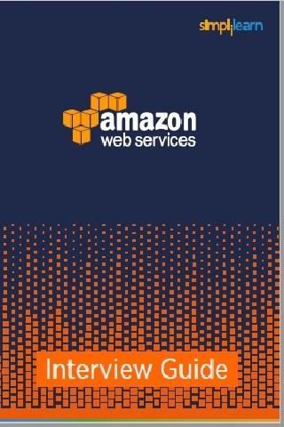 | 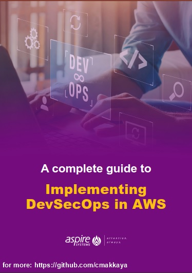 |   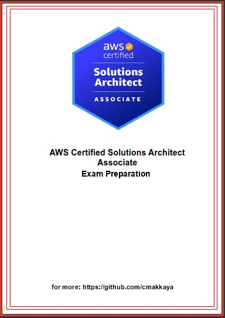 | 

|[AWS Services as SketchBook](resources/aws/AWS-Services-as-Sketchbook.pdf) | [AWS Cloud Practitioner Exam Guide](resources/aws/AWS-Cloud-Practitioner-Exam-Guide.pdf) |     |
| --|-- |-- |
|  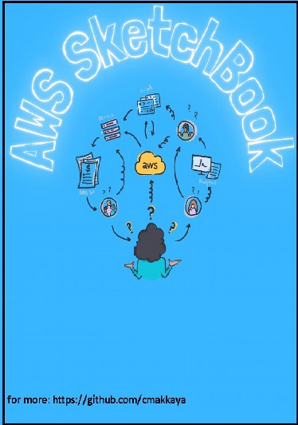 | 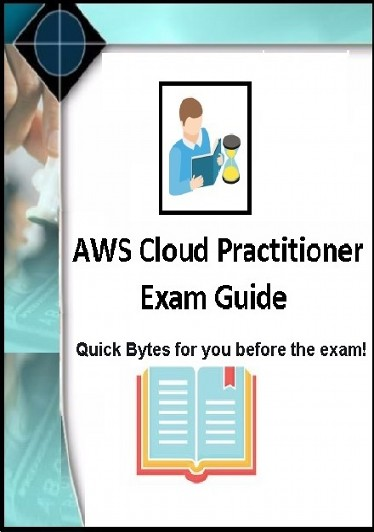 | [Add in `Readme.md`](https://github.com/cmakkaya/devops-cloud-resources/edit/main/README.md) |

# AZURE Resources
Note: In order to see Microsoft Azure documents, click on [the page link](azure-README.md), not the picture. Pictures give a preview of the first page of the Microsoft Azure documents.

| [Microsoft Azure Documents](azure-README.md)   - [the page link](azure-README.md)|    
| --|
|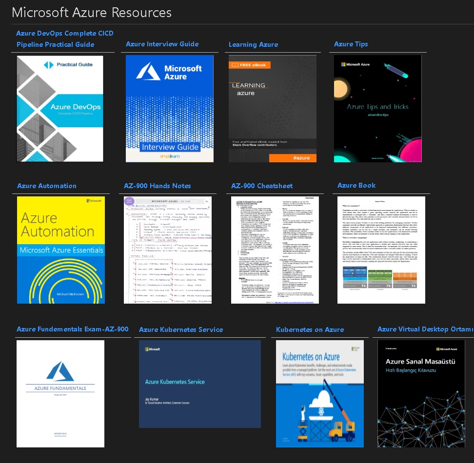 |

# GCP Resources

| [A Comlete Guide to GCP](resources/gcp/A-Comlete-Guide-to-GCP.pdf) |      |
| --| --|
|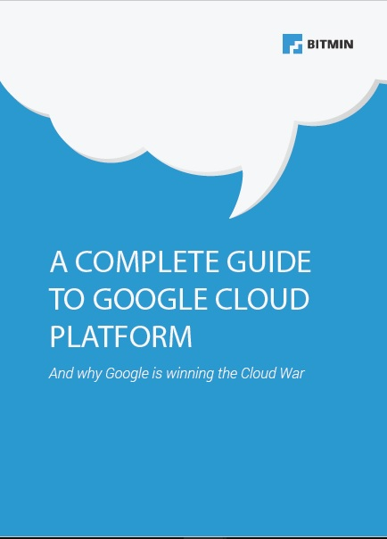 | [Add in `Readme.md`](https://github.com/cmakkaya/devops-cloud-resources/edit/main/README.md) |

# DevOps Resources
 
| [Learning ansible](resources/devops/ansible-learning.pdf) |  [Top DevOps Interview Questions](resources/devops/Top-DevOps-Interview-Questions.pdf) |  [Kubernetes Best Practices](resources/devops/Kubernetes-Best-Practices.pdf) | 
| --| --| --|
| |  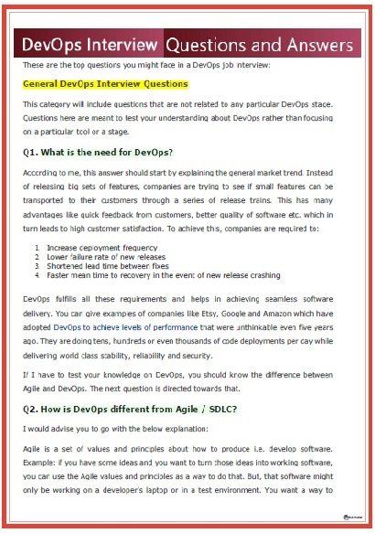 |  | 

[Docker & Docker Swarm](resources/devops/Docker&Docker-Swarm.pdf) |   [The State of DevOps tools](resources/devops/The-State-of-DevOps-tools.pdf) | [Terraform Associate Certification](resources/devops/250-Practice-Questions-For-Terraform-Associate-Certification.pdf) | 
| --| --| --| 
|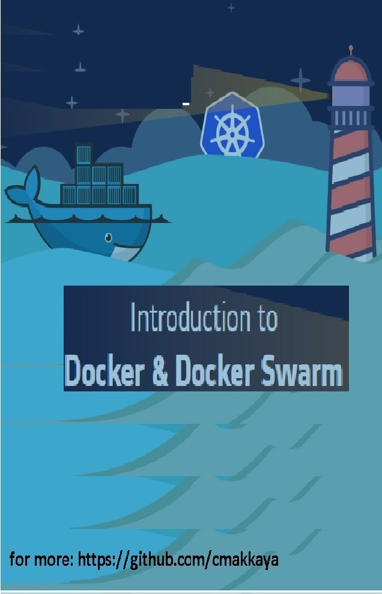 |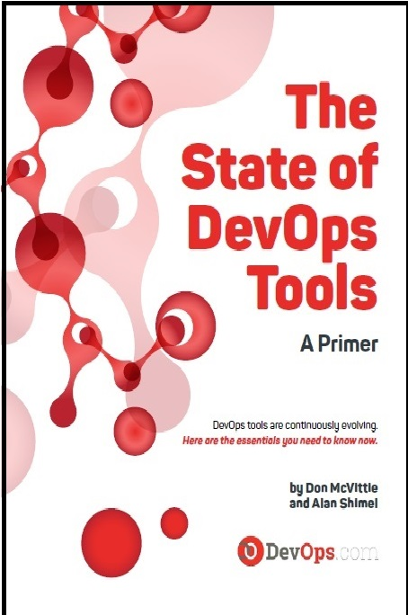 | 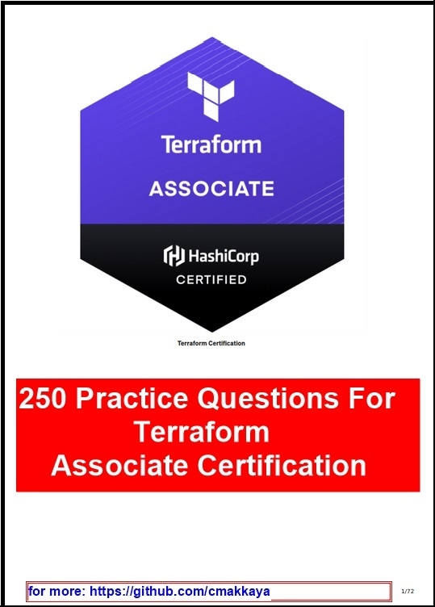 |

Note: In order to see the other DevOps documents, click on [the page link](devops-README.md), not the picture. Pictures give a preview of the first page of the DevOps documents.
| [The other DevOps documents page](devops-README.md)  - [the page link](devops-README.md)|    
| --|
|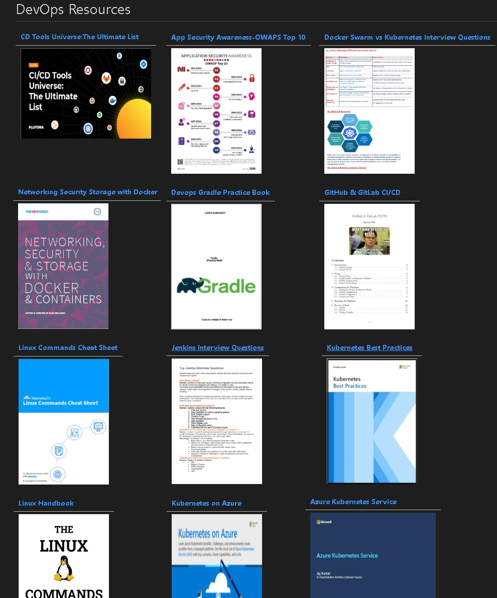 |

# Cheat Sheets

Note: In order to see cheatsheet documents, click on [the page link](cheatsheet-README.md), not the picture. Pictures give a preview of the first page of the cheatsheet.

| [Cloud and DevOps Cheat Sheets](cheatsheet-README.md)   - [the page link](cheatsheet-README.md)|    
| --|
|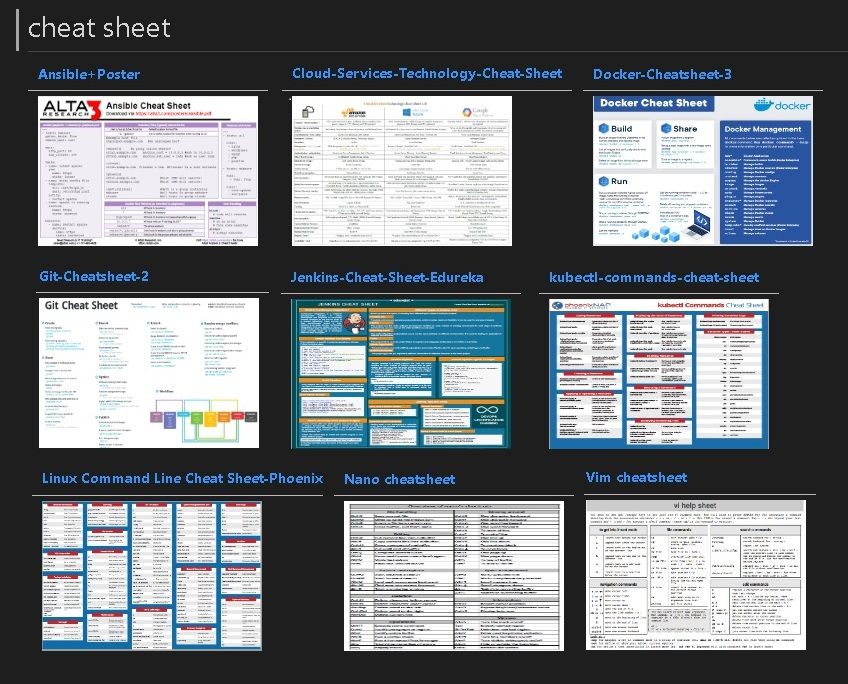 |

# August 2024 updates
Click on [the link](https://github.com/cmakkaya/devops-cloud-resources/tree/main/resources/Agu_2024) to see the files.

# May 2025 updates
Click on [the link](https://github.com/cmakkaya/devops-cloud-resources/tree/main/resources/May_2025) to see the files.

# Connect with me 📫 You can learn more about me

- 🌐 [LinkedIn](https://www.linkedin.com/in/cumhurakkaya/)
- 🌐 [GitHub](https://github.com/cmakkaya/)
- 🌐 [GitLab](https://gitlab.com/cmakkaya)
- ✏️ [Medium Articles](https://cmakkaya.medium.com/)
- ✏️ [Wordpress Articles](https://cloudplatformsanddevops.wordpress.com/)
- 🏢 [Portfolio/Resume Page](https://portfolio.cmakkaya-awsdevops.link/)
- 📺 [YouTube](https://www.youtube.com/channel/UCWcRIvy70tBBfrmBocDR5hA)

### Happy clouding...
