# About Microsoft Azure Resources Page

Microsoft Azure Resources Page

🔎 On this page, you may find resources (books, notes, interview questions, exam questions, cheat sheets, whitepapers, guides, hands-on, handbooks, etc.)  about `Microsoft Azure`.  Also, This page is part of the DevOps-Cloud resources page.

📚 I will continue adding new resources to the repository regularly and announce them on my LinkedIn account. 

You can also contribute by adding new resources to the repository.

⭐ Also, thank you for giving `stars` to my GitHub.

I hope they are helpful to you.

🙏 I wish you growing success.

# Microsoft Azure Resources

## Note: 
In order to see Microsoft Azure documents, click on `the link` not the picture. Pictures give a preview of the first page of Microsoft Azure documents or redirect to Github download page for pdf documents.

| [Azure DevOps Complete CICD Pipeline Practical Guide](resources/azure/Azure-DevOps-Complete-CICD-Pipeline-Practical-Guide.pdf) | 
| --| 
|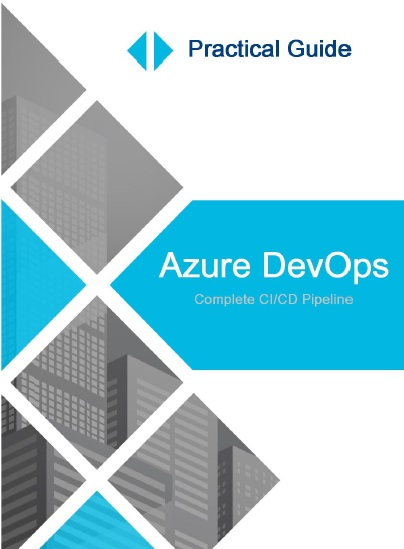 |

| [Azure Interview Guide](resources/azure/Azure-Interview-Guide.pdf) | 
| -- |
| 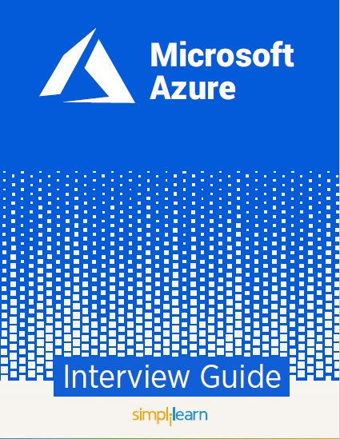 |   

| [Learning Azure](resources/azure/Azure-Learning-Azure.pdf) | 
| -- |
| 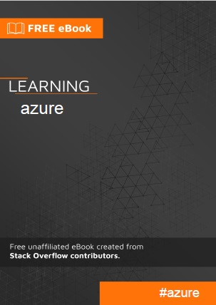 |

| [Azure Tips](resources/azure/Azure-tips.pdf) | 
| -- |
| 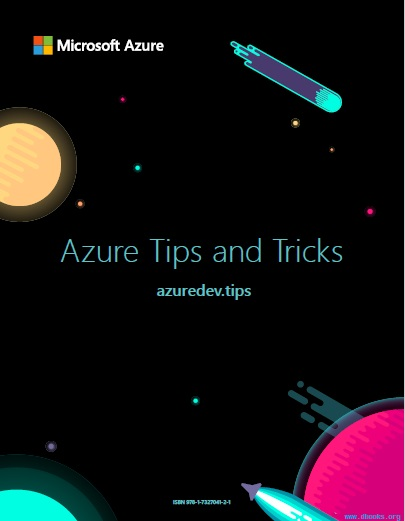 |

| [Azure Automation](resources/azure/Azure-Automation.pdf) | 
| -- |
| 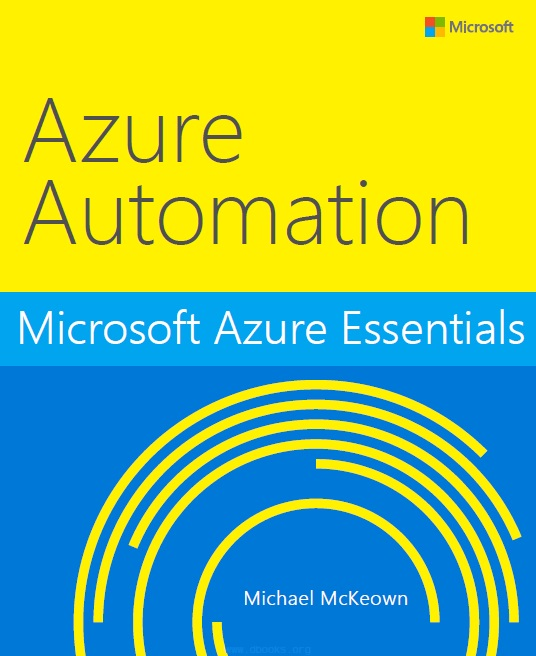 |

| [AZ-104 Certification Quick Bytes for you before the exam](resources/azure/AZ-104-Certification-Quick-Bytes-for-you-before-the-exam.pdf) | 
| -- |
| 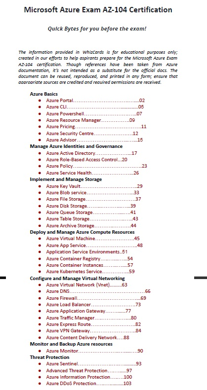 |

| [AZ-900 Cheatsheet](resources/azure/AZ-900-Cheatsheet.pdf) | 
| -- |
| 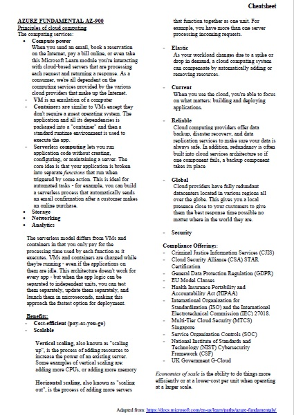 |

| [AZ-900 Hands Notes](resources/azure/AZ-900-hands-notes.pdf) | 
| -- |
| 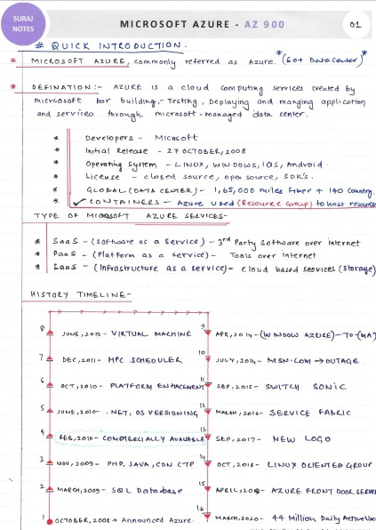 |

| [Azure Book](resources/azure/Azure-Book.pdf) | 
| -- |
| 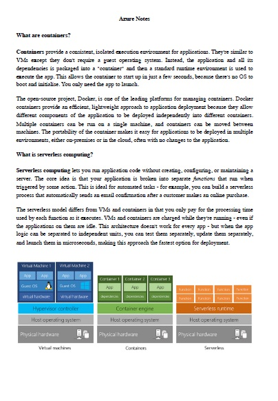 |

| [Azure DevOps Indhold](resources/azure/Azure-DevOps-indhold.pdf) | 
| -- |
|  |

| [Azure Fundementals Exam-AZ-900](resources/azure/Azure-Fundementals-Exam-AZ-900.pdf) | 
| -- |
| 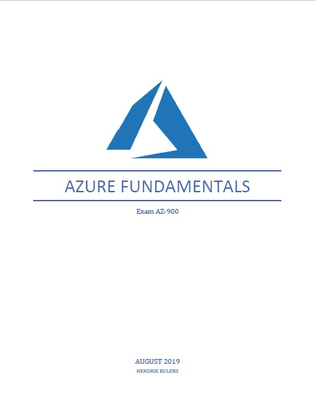 |

| [Azure Kubernetes Service](resources/azure/Azure-Kubernetes-Service.pdf) | 
| -- |
| 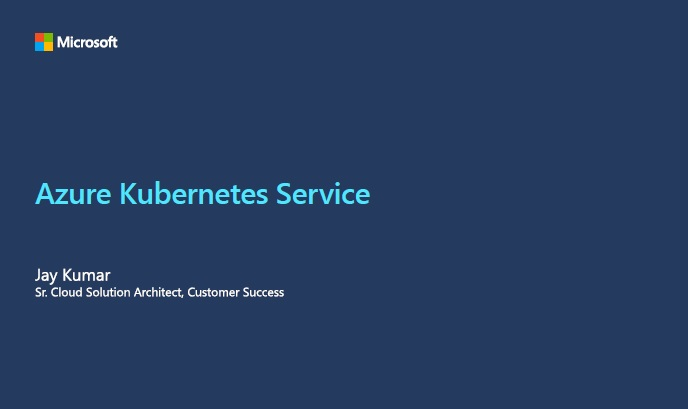 |

| [Azure Virtual Desktop Ortamına Baslagıç Kitabı-TR](resources/azure/Azure-Virtual-Desktop-Ortamina-Baslagic-Kitabi-TR.pdf) | 
| -- |
| 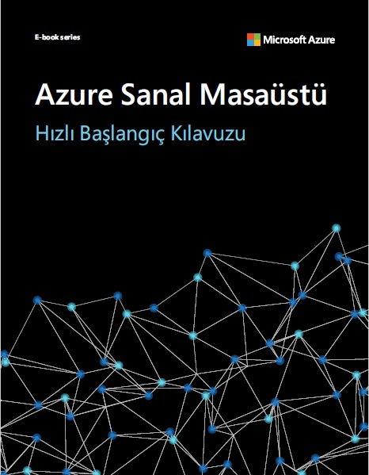 |

| [Kubernetes on Azure](resources/azure/Kubernetes-on-Azure.pdf) | 
| -- |
| 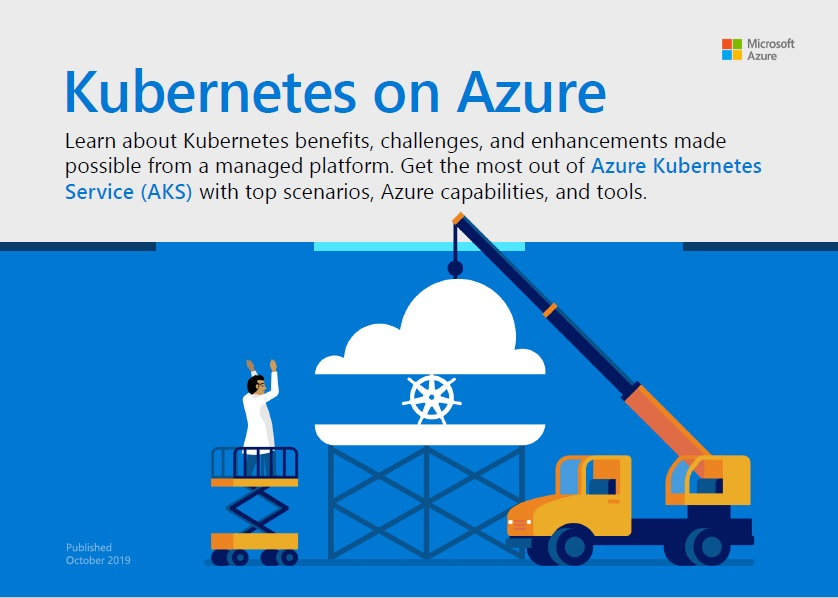 |

# Connect with me 📫 You can learn more about me

- 🌐 [LinkedIn](https://www.linkedin.com/in/cumhurakkaya/)
- 🌐 [GitHub](https://github.com/cmakkaya/)
- 🌐 [GitLab](https://gitlab.com/cmakkaya)
- ✏️ [Medium Articles](https://cmakkaya.medium.com/)
- ✏️ [Wordpress Articles](https://cloudplatformsanddevops.wordpress.com/)
- 🏢 [Portfolio/Resume Page](https://portfolio.cmakkaya-awsdevops.link/)
- 📺 [YouTube](https://www.youtube.com/channel/UCWcRIvy70tBBfrmBocDR5hA)

### Happy clouding...

Don't forget to follow [my linkedin](https://www.linkedin.com/in/cumhurakkaya/) or GitHub account to be informed about new updates in the repository.