# About Cheat Sheets Page

🔎 You may find cheatsheets about  `DevOps tools`  and  `Cloud System` in this page.

📚 I will try to add new cheatsheet to the repository regularly, and I will announce them on my linkedin account. 
You can also contribute by adding new resources to the repository.

⭐ Also, thank you for giving `stars` to my GitHub.

I hope they are useful to you.

🙏 I wish you growing success.

# Cheat sheets

## Note: in order to see cheatsheet documents, click on `the link` not picture. Pictures give a preview of the first page of cheatsheet or redirect to Github download page for pdf documents.

| [Ansible Poster Cheat sheet](resources/cheatsheets/Ansible+Poster.pdf) |      
| -- |
|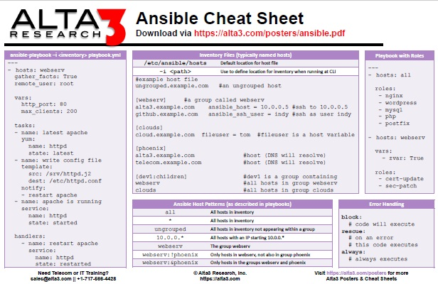 | 

| [Ansible Cheat sheet](resources/cheatsheets/Ansible.pdf) | 
| -- |
| 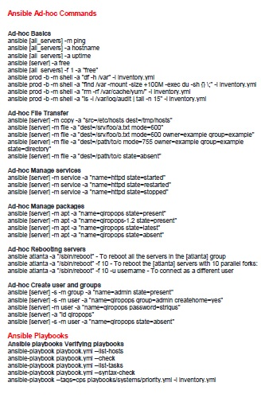 |   

| [CI/CD Pipeline Cheat sheet](resources/cheatsheets/CICDPipeline.png) |     
| -- |
| 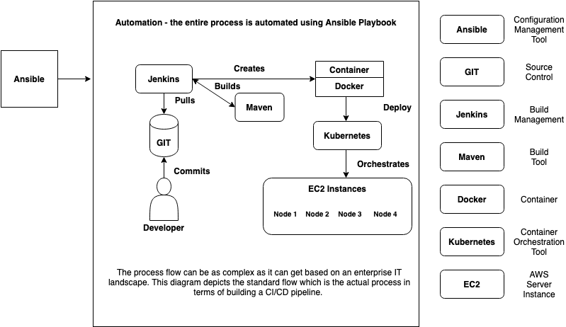 | 

| [Cloud Services Technology Cheat Sheet](resources/cheatsheets/Cloud-Services-Technology-Cheat-Sheet.png) |      
| -- |
|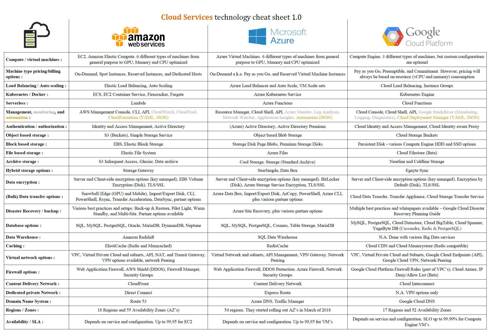 | 

| [Docker-Cheatsheet-1](resources/cheatsheets/docker-cheat-sheet-1.pdf) | 
| -- |
| 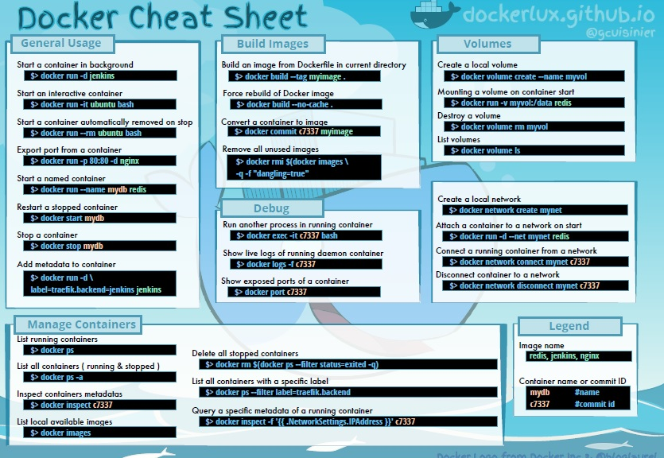 |   

| [Docker-Cheatsheet-2](resources/cheatsheets/docker-cheatsheet-2.pdf) |     
| -- |
| 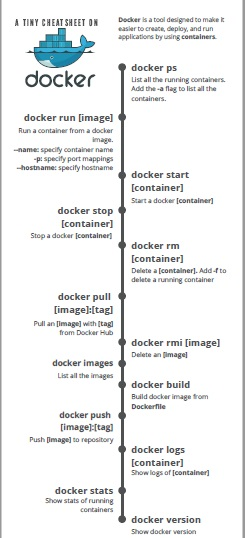 | 

| [Docker-Cheatsheet-3](resources/cheatsheets/docker-cheat-sheet-3.pdf) | 
| -- |
| 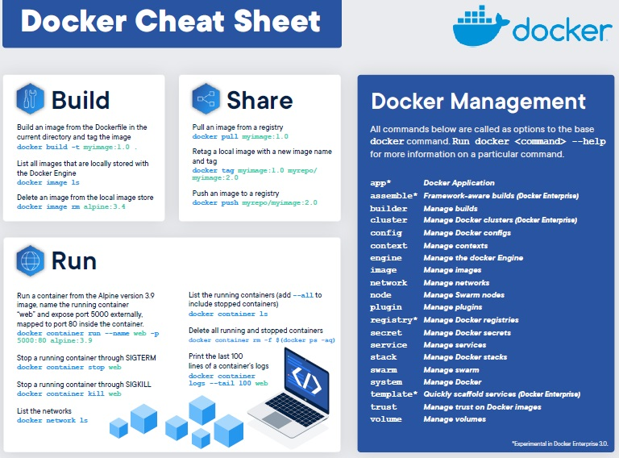 |   

| [Docker-Cheatsheet-4](resources/cheatsheets/docker-cheat-sheet-4.png) |     
| -- |
|  |

| [Docker-Cheatsheet-5](resources/cheatsheets/docker-cheat-sheet-5.pdf) | 
| -- |
| 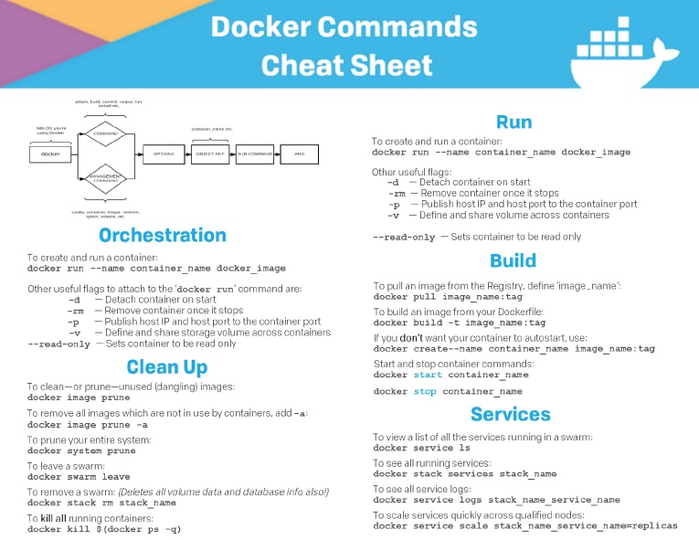 |   

| [Docker-Cheatsheet-6](resources/cheatsheets/docker-cheat-sheet-6.pdf) |     
| -- |
| 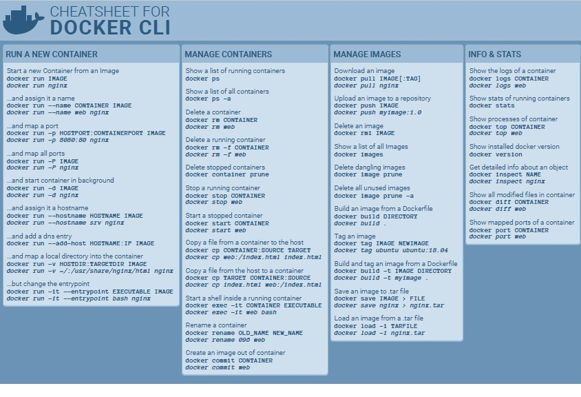 |

| [Docker-Cheatsheet-TR](resources/cheatsheets/Docker-CheatSheet-Turkce_TR.pdf) |     
| -- |
|  |

| [Flask Cheat Sheet and Quick Reference](resources/cheatsheets/Flask-Cheat-Sheet-and-Quick-Reference.pdf) | 
| -- |
| 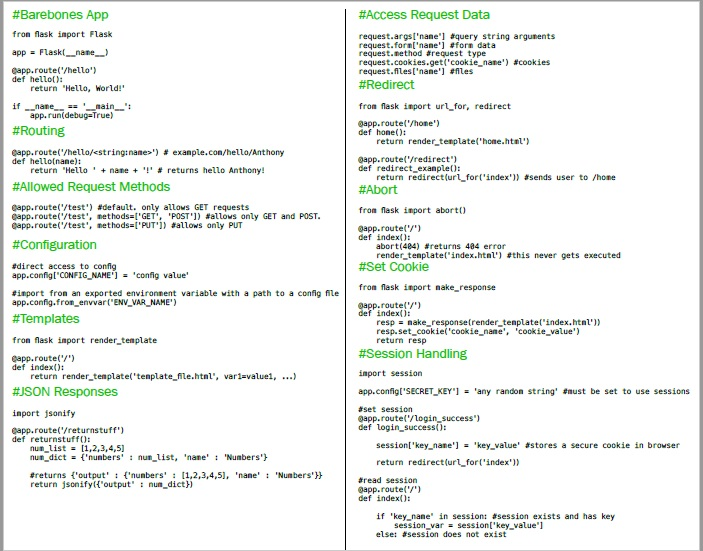 |   

| [Git-Cheatsheet-1](resources/cheatsheets/git1.png) |     
| -- |
| 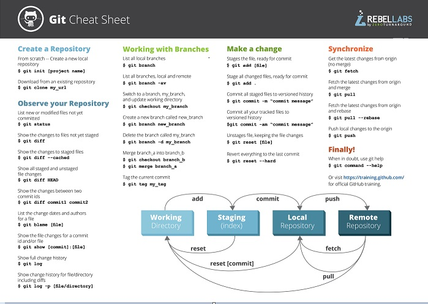 |

| [Git-Cheatsheet-2](resources/cheatsheets/git2.png) |     
| -- |
| 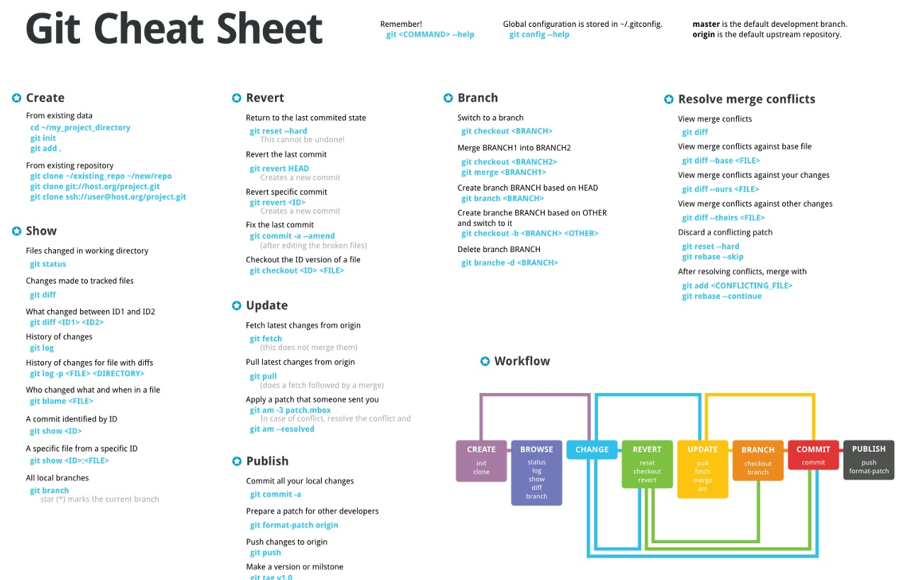 |

| [Git-Cheatsheet-3](resources/cheatsheets/git3.png) |     
| -- |
|  |

| [Git-Cheatsheet-4](resources/cheatsheets/git4.png) |     
| -- |
|  |

| [Git-Cheatsheet-5](resources/cheatsheets/git5.pdf) |     
| -- |
| 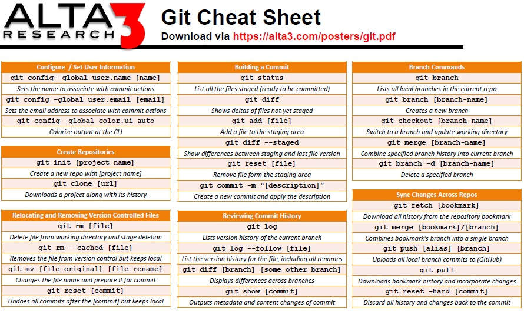 |

| [Git-Cheatsheet-TR](resources/cheatsheets/git-Cheat_Sheet_short-TR.pdf) |     
| -- |
| 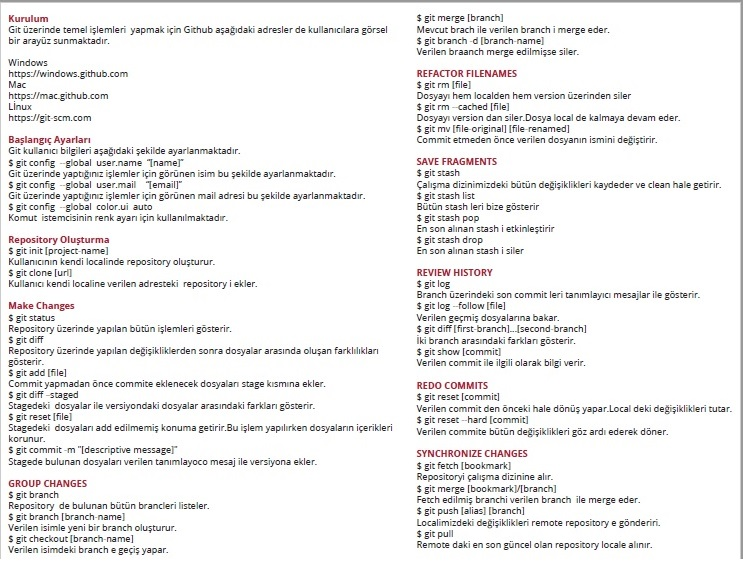 |

| [Jenkins-Cheat-Sheet](resources/cheatsheets/Jenkins-Cheat-Sheet.jpg) |     
| -- |
| 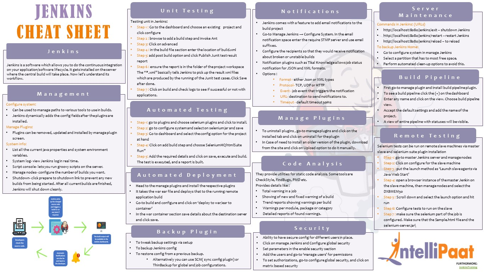 |

| [Jenkins-Cheat-Sheet-Edureka](resources/cheatsheets/Jenkins-Cheat-Sheet-Edureka.pdf) |     
| -- |
| 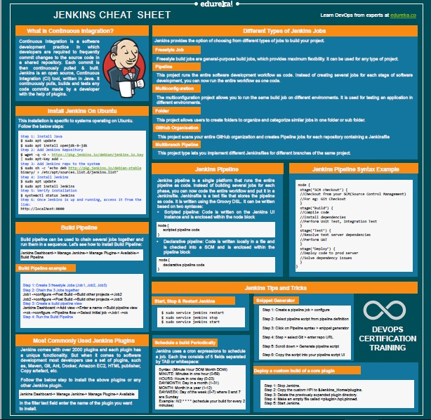 |

| [Kubernetes Cheat Sheet](resources/cheatsheets/k8s.pdf) |     
| -- |
| 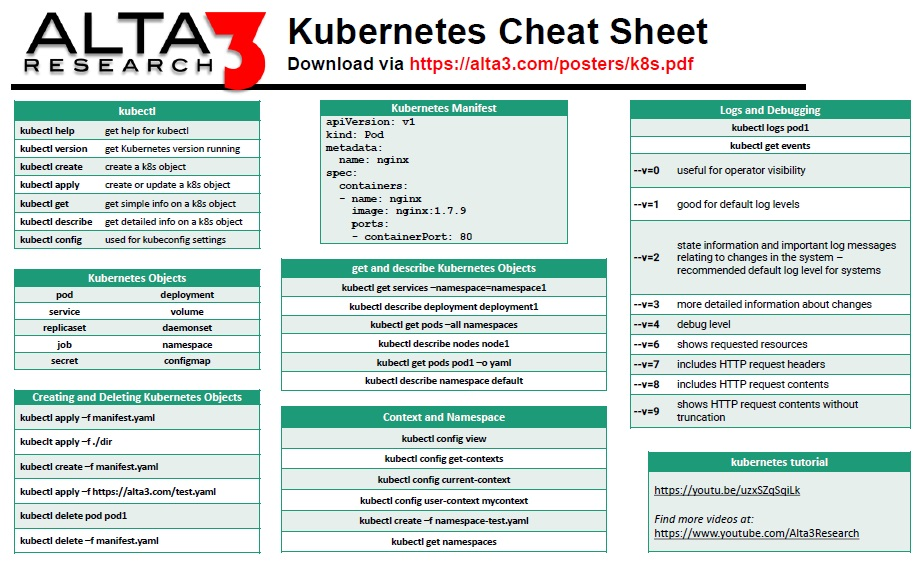 |

| [kubectl-commands-cheat-sheet](resources/cheatsheets/kubectl-commands-cheat-sheet-by-pnap.pdf) |     
| -- |
| 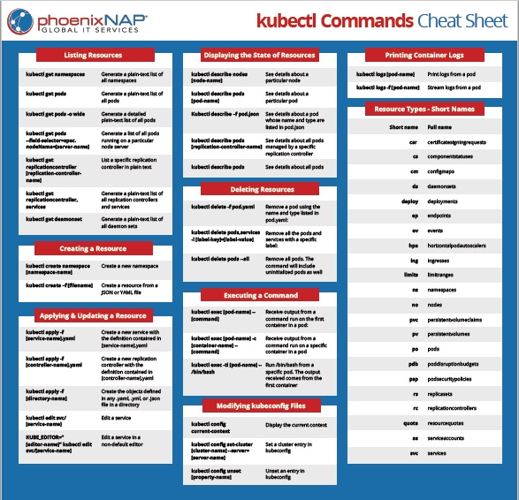 |

| [Kubernetes Cheat Sheet-2](resources/cheatsheets/kubernetes.pdf) |     
| -- |
| 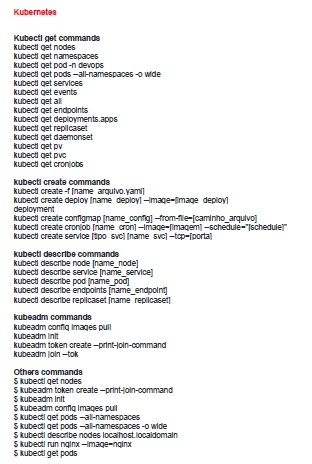 |

| [Linux-Root-Folder](resources/cheatsheets/Linux-Root-Folder.jpg) |     
| -- |
|  |

| [Linux Commands_En](resources/cheatsheets/Linux_Commands_En.pdf) |     
| -- |
| 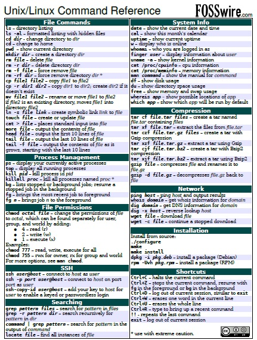 |

| [Linux Commands_Tr](resources/cheatsheets/Linux_Komutlar_Tr.pdf) |     
| -- |
| 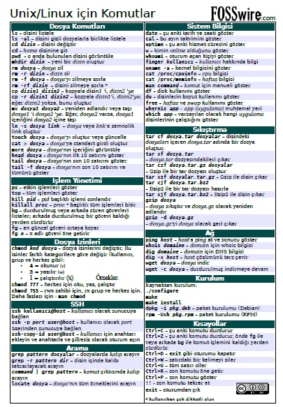 |

| [Linux Command Line Cheat Sheet](resources/cheatsheets/linux-command-linedavechild.pdf) |     
| -- |
| 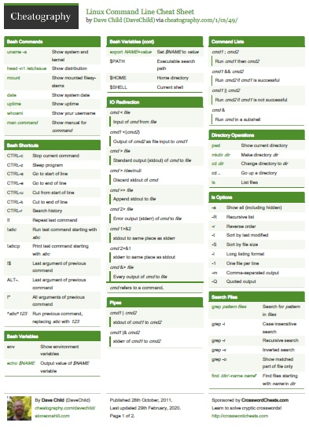 |

| [Linux Command Line Cheat Sheet-Phoenix](resources/cheatsheets/linux-commands-cheat-sheet-pnap_Phoenix_short.pdf) |     
| -- |
| 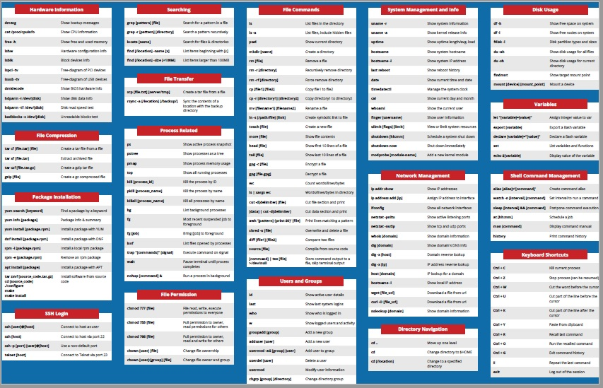 |

| [ Linux Commands Cheat Sheet ](resources/devops/Linux-Commands-Cheat-Sheet-20-pages.pdf) | 
| --| 
|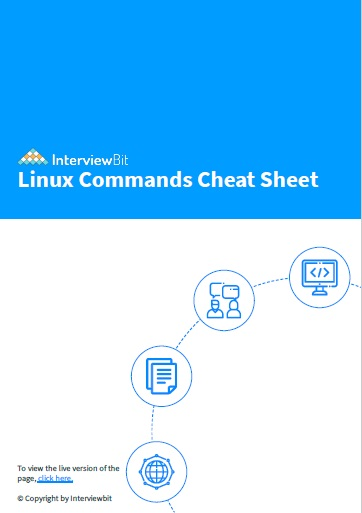 |

| [Nano cheatsheet](resources/cheatsheets/Nano-cheatsheet_mesut.pdf) |     
| -- |
| 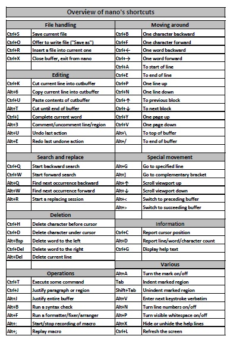 |

| [Terraform cheatsheet](resources/cheatsheets/Terraform.pdf) |     
| -- |
| 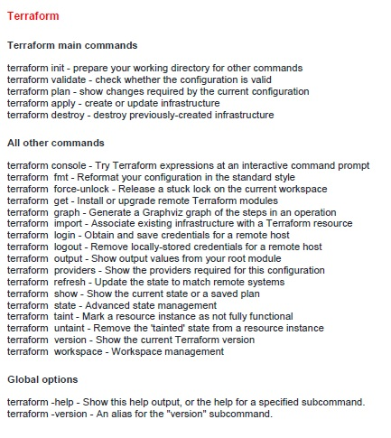 |

| [tmux](resources/cheatsheets/tmux.pdf) |     
| -- |
| 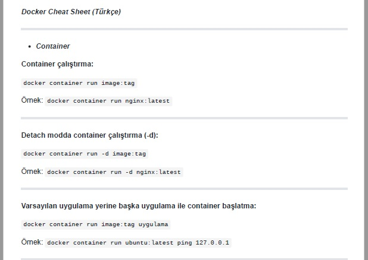 |

| [Vim cheatsheet](resources/cheatsheets/Vim_cheatsheet.png) |     
| -- |
|  |

# Connect with me 📫 You can learn more about me

- 🌐 [LinkedIn](https://www.linkedin.com/in/cumhurakkaya/)
- 🌐 [GitHub](https://github.com/cmakkaya/)
- 🌐 [GitLab](https://gitlab.com/cmakkaya)
- ✏️ [Medium Articles](https://cmakkaya.medium.com/)
- ✏️ [Wordpress Articles](https://cloudplatformsanddevops.wordpress.com/)
- 🏢 [Portfolio/Resume Page](https://portfolio.cmakkaya-awsdevops.link/)
- 📺 [YouTube](https://www.youtube.com/channel/UCWcRIvy70tBBfrmBocDR5hA)

### Happy clouding...

Don't forget to follow [my linkedin](https://www.linkedin.com/in/cumhurakkaya/) or GitHub account to be informed about new updates in the repository.