# About DevOps Resources Page

DevOps Resources Page

🔎 On this page, you may find resources (books, notes, interview questions, exam questions, cheat sheets, whitepapers, guides, hands-on, handbooks, etc.)  about `DevOps Tools`.  Also, This page is part of the DevOps-Cloud resources page.

📚 I will continue adding new resources to the repository regularly and announce them on my LinkedIn account. 

You can also contribute by adding new resources to the repository.

⭐ Also, thank you for giving `stars` to my GitHub.

I hope they are helpful to you.

🙏 I wish you growing success.

# DevOps Resources

## Note: 
In order to see DevOps documents, click on `the link` not the picture. Pictures give a preview of the first page of DevOps documents or redirect to Github download page for pdf documents.

| [ CD Tools Universe:The Ultimate List ](resources/devops/CICD-Tools-Universe-The-Ultimate-List.pdf) | 
| --| 
|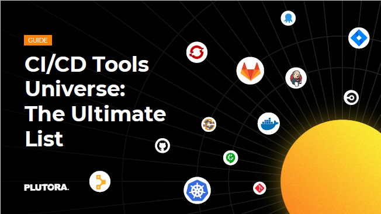 |

| [ App Security Awareness-OWAPS Top 10 ](resources/devops/App-Security-Awareness.pdf) | 
| --| 
|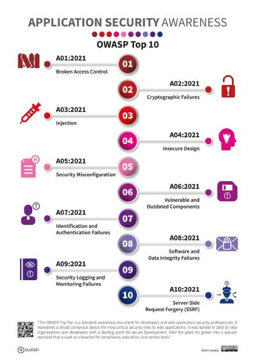 |

| [ Devops Gradle Practice Book ](resources/devops/Devops-Gradle-Practice-Book.pdf) | 
| --| 
|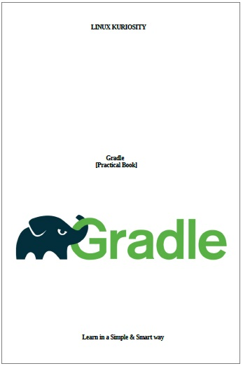 |

| [ Docker Swarm vs Kubernetes Interview Questions ](resources/devops/Docker-Swarm-vs-Kubernetes-interview.pdf) | 
| --| 
|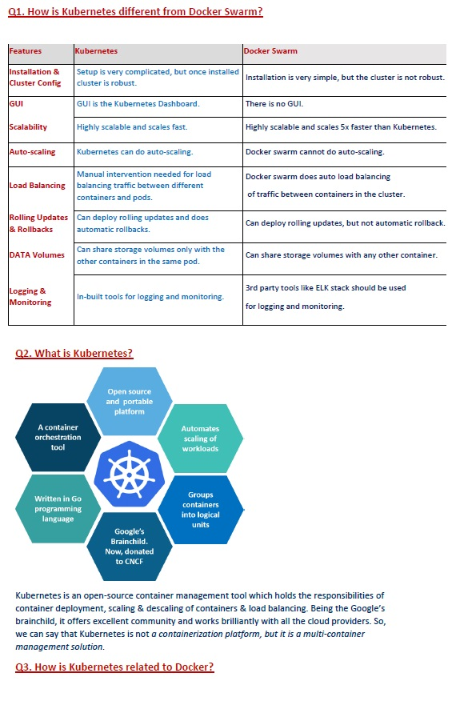 |

| [ GitHub & GitLab CI/CD ](resources/devops/GitHub-GitLab-CICD.pdf) | 
| --| 
|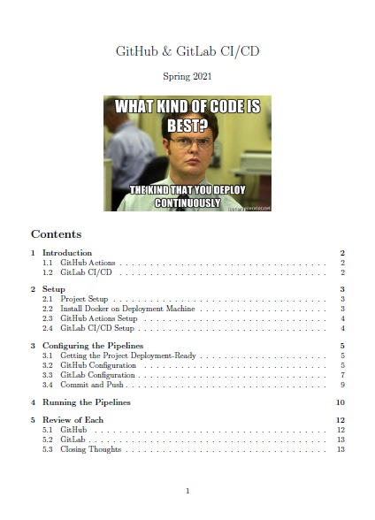 |

| [ Jenkins Interview Questions ](resources/devops/Jenkins-Interview-Questions.pdf) | 
| --| 
| |

| [ Kubernetes Best Practices ](resources/devops/Kubernetes-Best-Practices.pdf) | 
| --| 
|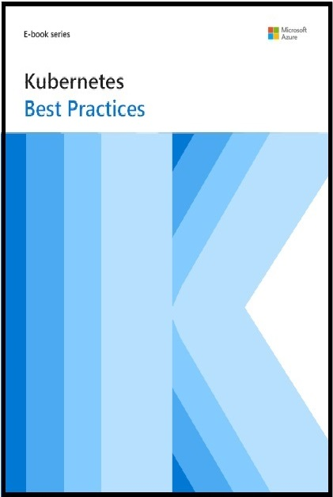 |

| [ Linux Commands Cheat Sheet ](resources/devops/Linux-Commands-Cheat-Sheet-20-pages.pdf) | 
| --| 
| |

| [ Linux Handbook ](resources/devops/Linux-Handbook.pdf) | 
| --| 
|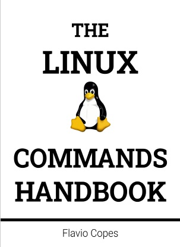 |

| [ Networkıng Securıty Storage with Docker ](resources/devops/Networkıng-securıty-storage-with-docker.pdf) | 
| --| 
|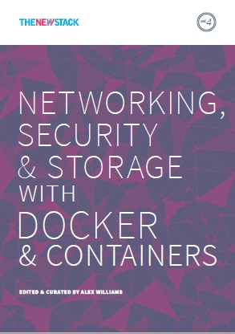 |

| [Azure DevOps Indhold](resources/azure/Azure-DevOps-indhold.pdf) | 
| -- |
|  |

| [Azure Kubernetes Service](resources/azure/Azure-Kubernetes-Service.pdf) | 
| -- |
|  |

| [Kubernetes on Azure](resources/azure/Kubernetes-on-Azure.pdf) | 
| -- |
|  |

| [Exploring Cloud Computing](resources/devops/Exploring-Cloud-Computing.pdf) | 
| --| 
|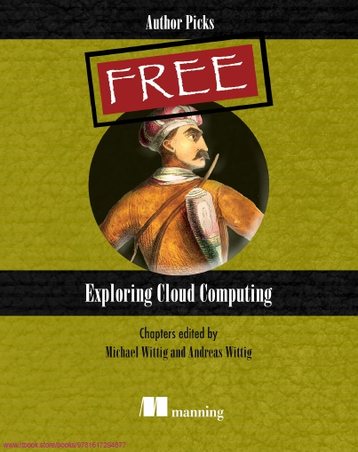 |

| [Ansible for DevOps - Jeff Geerling](resources/devops/ansible-for-devops.pdf) | 
| --| 
|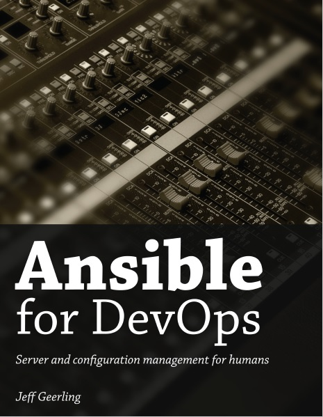 |

| [Learning Ansible](resources/devops/ansible-learning.pdf) | 
| --|
|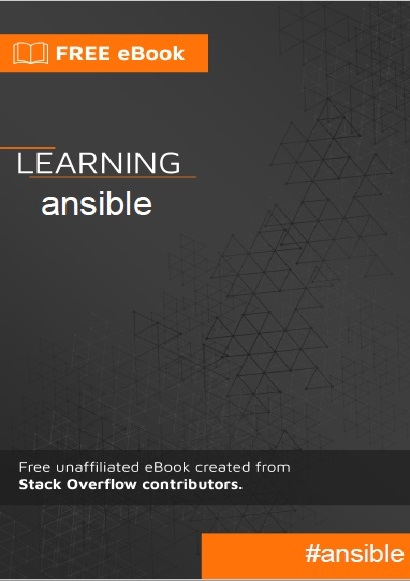 |

# Connect with me 📫 You can learn more about me

- 🌐 [LinkedIn](https://www.linkedin.com/in/cumhurakkaya/)
- 🌐 [GitHub](https://github.com/cmakkaya/)
- 🌐 [GitLab](https://gitlab.com/cmakkaya)
- ✏️ [Medium Articles](https://cmakkaya.medium.com/)
- ✏️ [Wordpress Articles](https://cloudplatformsanddevops.wordpress.com/)
- 🏢 [Portfolio/Resume Page](https://portfolio.cmakkaya-awsdevops.link/)
- 📺 [YouTube](https://www.youtube.com/channel/UCWcRIvy70tBBfrmBocDR5hA)

### Happy clouding...

Don't forget to follow [my linkedin](https://www.linkedin.com/in/cumhurakkaya/) or GitHub account to be informed about new updates in the repository.